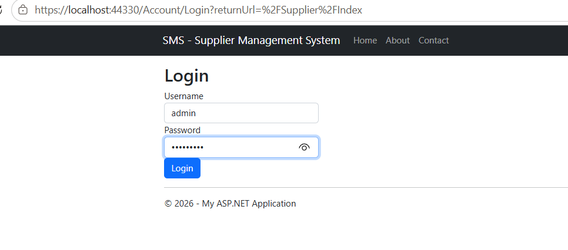
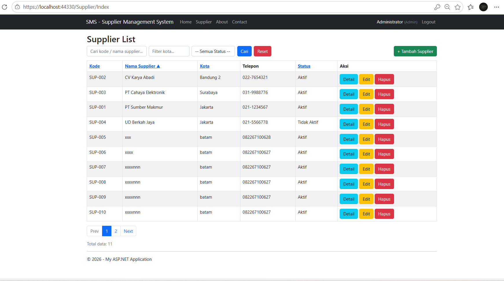
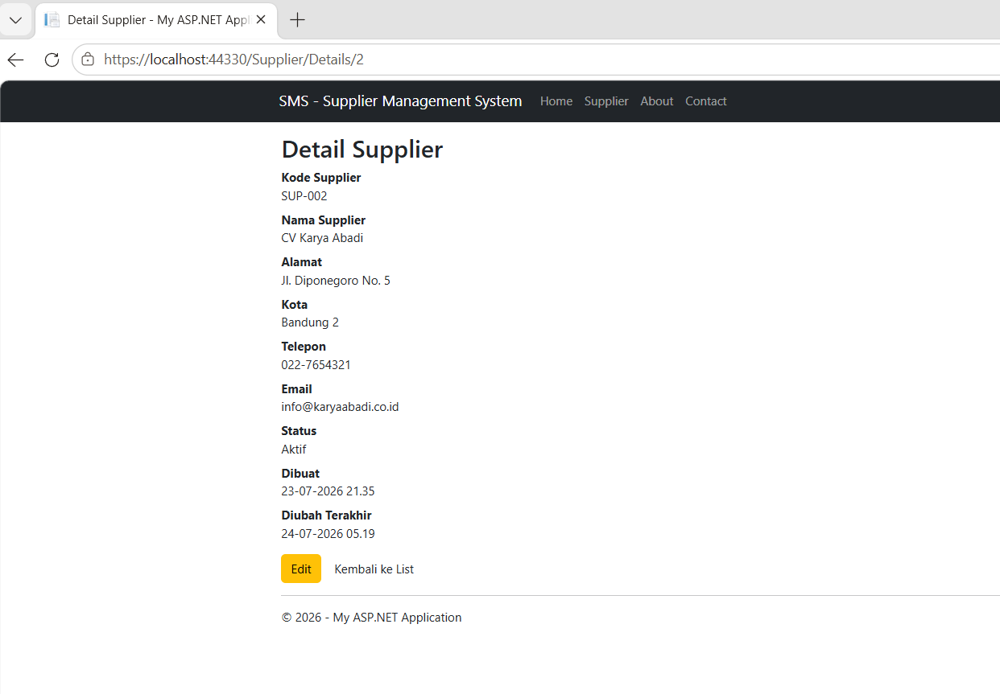
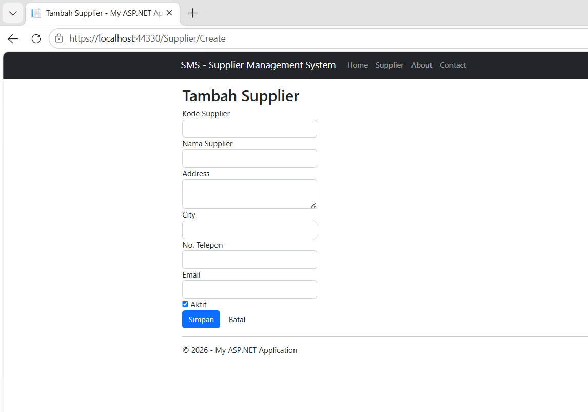
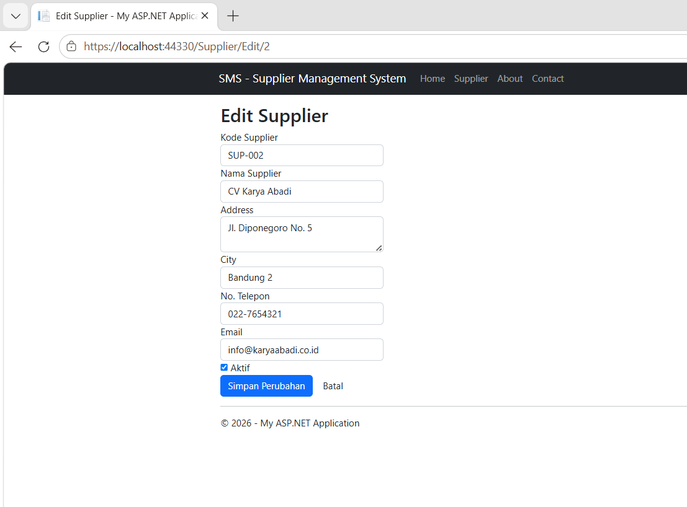
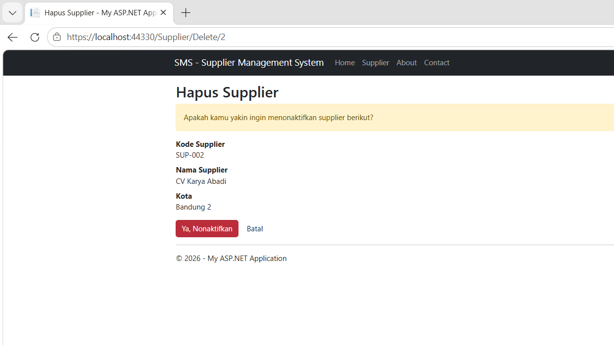
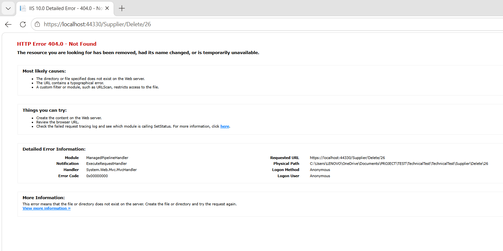

# TechnicalTest

Aplikasi **ASP.NET MVC (.NET Framework 4.8)** untuk mengelola data Supplier. Project ini menerapkan **ADO.NET**, **Stored Procedure**, **Repository Pattern**, **Service Layer**, **Role-Based Access Control (RBAC)**, serta **Global Error Handling**.

---

# Teknologi yang Digunakan

- ASP.NET MVC 5
- .NET Framework 4.8
- SQL Server
- ADO.NET
- Stored Procedure
- Repository Pattern
- Service Layer
- Bootstrap 5

---

# Fitur

- Login & Authentication
- Role-Based Access Control (Admin & Supplier)
- CRUD Supplier
- Search Supplier
- Pagination
- Validasi Duplicate Supplier Code
- Global Error Handling
- Logging Error ke Database
- Soft Delete Supplier

---

# Screenshot

## Login



---

## Dashboard / Daftar Supplier



---

## Detail Supplier



---

## Tambah Supplier



---

## Edit Supplier



---

## Hapus Supplier



---

## Error Handling



---

# Persyaratan

Sebelum menjalankan aplikasi, pastikan telah tersedia:

- .NET Framework 4.8
- SQL Server
- Visual Studio 2019 / 2022 / 2026

---

# Database / Stored Procedure

Aplikasi menggunakan seluruh akses database melalui **Stored Procedure**.

Stored Procedure yang digunakan:

- `sp_Supplier_GetList`
- `sp_Supplier_Search`
- `sp_Supplier_GetById`
- `sp_Supplier_Insert`
- `sp_Supplier_Update`
- `sp_Supplier_Delete`
- `sp_Supplier_CheckDuplicateCode`
- `sp_ErrorLog_Insert`

---

# Struktur Project

```text
TechnicalTest
│
├── Controllers
├── Filters
├── Helpers
├── Models
├── Repositories
├── Services
├── Views
├── docs
│   └── images
└── Web.config
```

---

# Catatan Implementasi

Beberapa implementasi utama pada project ini:

- Menggunakan **ADO.NET** untuk seluruh akses database.
- Seluruh operasi CRUD dilakukan melalui **Stored Procedure**.
- Repository bertanggung jawab terhadap akses data.
- Business Logic dipisahkan ke dalam **Service Layer**.
- Controller hanya menangani HTTP Request & Response.
- Menggunakan **OperationResult** untuk komunikasi antara Service dan Controller.
- Global Exception Handling menggunakan `GlobalExceptionFilter`.
- Logging error disimpan ke database menggunakan `DbLogger`.
- Authentication dan Authorization menggunakan custom `AuthorizeUserAttribute`.

---

# Menjalankan Project

1. Clone repository.

2. Restore NuGet Packages.

3. Ubah connection string `TechnicalTestDB` pada file `Web.config`.

4. Pastikan database beserta seluruh Stored Procedure telah dibuat.

5. Build project.

6. Jalankan menggunakan IIS Express atau Local IIS.

---

# Peningkatan yang Dilakukan

- Memisahkan Business Logic ke dalam **Service Layer**.
- Menambahkan **OperationResult** untuk standardisasi hasil operasi.
- Mengurangi duplikasi kode pada Controller.
- Memperjelas pemisahan tanggung jawab antara Controller, Service, dan Repository.
- Menerapkan Clean Code dan Separation of Concerns.

---
